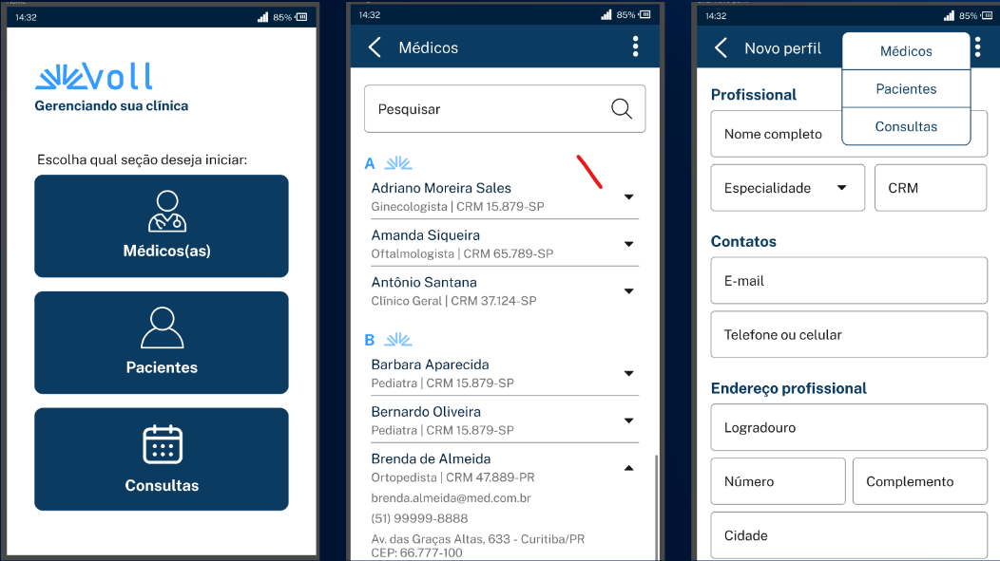

# Voll.med API 🩺
Bem-vindo(a) ao repositório da API Voll.med, desenvolvida como projeto principal do curso "Spring Boot 3: desenvolva uma API Rest em Java" da Alura.

Instrutor: Rodrigo Ferreira

## 📄 Sobre o Projeto
A Voll.med é uma API RESTful projetada para gerenciar as operações de uma clínica médica fictícia. O sistema permite o cadastro e a gestão de médicos e pacientes, além do agendamento e cancelamento de consultas, servindo como backend para uma aplicação front-end (mobile ou web).

O foco deste projeto é construir uma API robusta, seguindo as melhores práticas de desenvolvimento, com validações de dados, paginação, ordenação e um sistema de migração de banco de dados bem estruturado.

## 📱 Protótipo da Aplicação
As funcionalidades da API foram pensadas para atender a uma aplicação como a do protótipo abaixo:

## 🎯 Objetivos do Projeto
Desenvolvimento de uma API REST completa: Construir endpoints para todas as funcionalidades principais da clínica.

Implementação de um CRUD completo: Desenvolver as quatro operações fundamentais (Create, Read, Update, Delete) para as entidades de Médicos e Pacientes.

Validações: Aplicar regras de negócio e validações nos dados de entrada utilizando o Bean Validation.

Paginação e Ordenação: Implementar recursos para otimizar a listagem de dados, tornando a API mais performática e escalável.

## ✨ Funcionalidades Implementadas
### [x] CRUD de Médicos:

- Cadastro de novos médicos.

- Listagem paginada e ordenada de todos os médicos.

- Atualização de informações de um médico.

- Exclusão lógica (inativação) de um médico.

### [x] CRUD de Pacientes:

- Cadastro de novos pacientes.

- Listagem paginada e ordenada de pacientes.

- Atualização de dados cadastrais.

- Exclusão lógica de pacientes.

### [x] Agendamento de Consultas:

- Endpoint para agendar uma nova consulta, aplicando as regras de negócio da clínica.

### [x] Cancelamento de Consultas:

- Endpoint para cancelar um agendamento existente, com suas respectivas validações.

## 🛠️ Tecnologias Utilizadas
O projeto foi construído utilizando o que há de mais moderno no ecossistema Java e Spring:

### Backend:

- Java 21: Versão LTS mais recente do Java, com recursos modernos de linguagem.

- Spring Boot 3: Framework principal para a criação da API REST.

-  Data JPA / Hibernate: Para a camada de persistência de dados de forma simplificada.

- Maven: Gerenciador de dependências e build do projeto.

#### Banco de Dados:

- Postgres: Sistema de gerenciamento de banco de dados relacional.

- Flyway: Ferramenta para versionamento e controle de migrações (migrations) do banco de dados.

#### Ferramentas e Bibliotecas:

- Lombok: Para reduzir código boilerplate (getters, setters, construtores, etc.).

Postman: Ferramenta para testes e validação dos endpoints da API.

##### Feito com 🔹 no curso da Alura.
